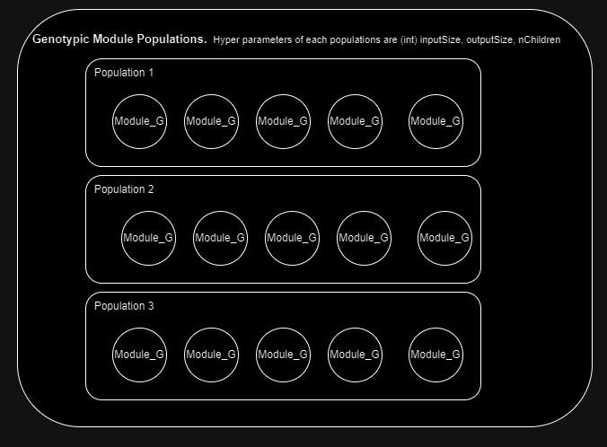
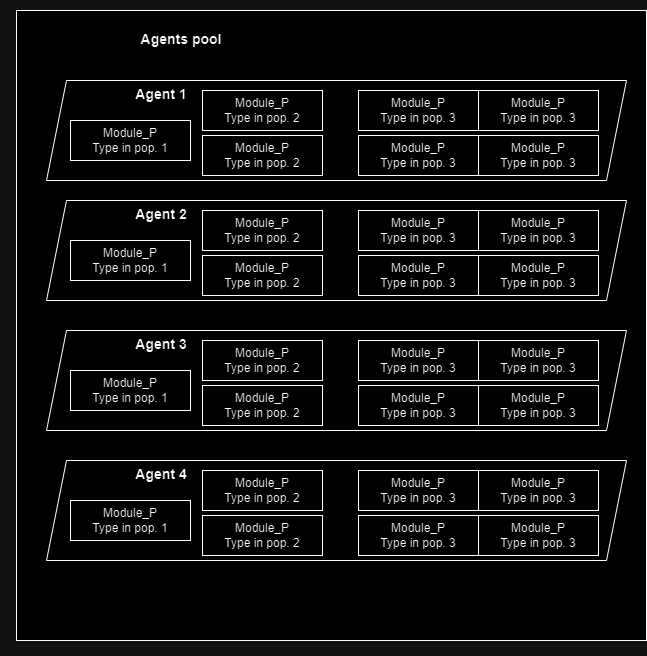
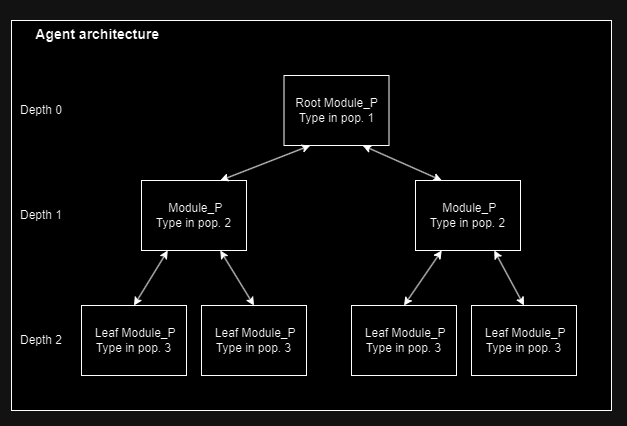
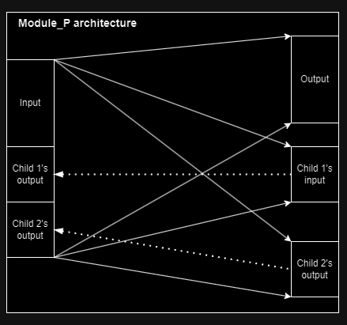

# CUDA_MoEv

A 2 loops learning algorithm. Black box optimization, so it can be applied to any problem, even those requiring collaborating agents. Instances of the problem to be solved will be refered to as *trials*. Trials do not return rewards at each step, but only a *score* at the end.

## Agent local rules

The agents use local learning rules to learn during their lifetime. Hebbian rules + modulated eligibility traces were supported (ABCD_ETA, or SPRAWL_PRUNE), but are not updated anymore so they may not compile. Currently, the learning rule is a modulated version of predictive coding. 

## The meta-learning algorithm

The meta-optimizer is akin to a genetic algorithm, but there significant differences.

*Agents* are not directly evolved, but are made of *phenotypic modules* (Module_P). A phenotypic module has a set of parameters that are modified by the agent during its lifelong learning, like Hebbian weights, or predictive coding weights, activations, modulation values, .... A phenotypic module also has a *type*, a pointer to a *genotypic module* (Module_G). A genotypic module is a set of parameters that are evolved by the meta-optimizer. Hebbian rules parameters, or initial predictive coding weights for instance. 
A phenotypic module belongs to only one agent, and an agent is nothing more than the set of its phenotypic modules. But several phenotypic modules, belonging to one or several agents, can have the same type. Genotypic modules are not owned nor managed by agents, but by the meta-optimizer. They are the evolved quantities of the algorithm, forming a common genomic pool. 
Genotypic modules are split into several fixed size *populations*, varying from each other by size hyperparameters. All agents have the same architecture, they only differ by the values of their phenotypic and genotypic real-valued parameters. Therefore all agents have the same number of types from each population. 

#### Agent structure

The agent's network architecture is a tree of modules. The agent has a pointer to the root node, and an inference / learning step is performed by calling the appropriate recursive function on the root node. 
A phenotypic module has an input activation vector, an output activation, and a set of children phenotypic modules. Leaf modules do not have children. The root is at depth 0, (also called layer in the code)
its children at depth 1, etc. All phenotypic modules at a certain depth have types from the same population, so they have the same size hyperparameters, which includes the number of children. 

*In this example, the agents have 3 "layers", and both the first and second layer's modules have 2 children. On the right, the internal structure of a Module_P that has 2 children. To make it a leaf, keep only the input and output blocs. When the local rule is predictive coding, the lefthand layer predicts the mean of the righthand layer.*
 
 
## Lifelong learning loop

There are 2 imbricated evolution loops. The outermost is over evolution steps, called *module cycles*. The innermost is over *agents cycles*.

### agent cycle

- Supervised learning phase: All agents experiences a number of trials. During a trial, each agent is paired with a teacher agent. Teacher agents are the subset that performed the best in the previous steps. At each step of the trial, the observation is transmitted to both the teacher and the student agent. The teacher's action are computed, and used to supervise the student's actions. The actions sent to the trial are those of the teacher. At the end of the trial, the score is discarded.

- Unsupervised evaluation phase: All agents experience trials. After each trial, the agents lifetime fitnesses are updated with and exponential moving average, using a transformation of the score on the trial.

- Once all agents have been evaluated: Each agent updates the fitness of all genotypic modules that are pointed to by its phenotype (exponential moving average with the agent's fitness). Then, the agent's lifetime fitnesses are sorted, and the worst x percentile is eliminated (x is a hyperparameter). The same number of agents is created to replace them. At an agent's creation, a set of genotypic modules are sampled from the populations. The phenotype is initialized, by copying the genotype's weights to the phenotype in the case of PC. The modification of these weights during the agents lifetime does not impact the genotype: the meta-learned weights are just used to initialize the lifetime weights.

### *module cycle*, or evolution step

- Perform a number of agent cycles.
- In each population, remove the worst y percentile of genotypic modules, and replace them with new ones. A module (G) is created by first combining a *primary* parent module with its relatives, and then mutating the result. The primary parent is sampled from the population with a bias towards high fitnesses. The relatives are sampled among modules that are phylogenetically not too far from the primary parent, also with a bias towards high fitnesses. Ttrack is kept of these relations with a phylogenetic tree. The *combination* is then the usual crossover operations, generalized to *n* parents (this whole process is generalized mating).

  
   
    

Evolution then consists in repeating module cycles until convergence or satisfactory results.
